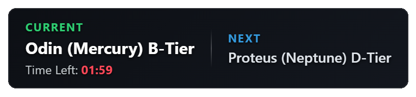

[English README](README_en.md) / 日本語
# arbys-obs-widget

OBSなどの配信ソフトで使用できる、Warframeの仲裁ミッション表示用オーバーレイウィジェットです。

---

## 「arby-obs-widget」の設定手順

### 1. ウィジェットURLのコピー
まずは以下の対象URLをコピーします。
*  `https://wasurengel.github.io/arbys-obs-widget/`

### 2. OBSに「ブラウザ」ソースを追加する
1. **OBS Studio**を起動します。
2. 画面下部にある「ソース」ウインドウの **「＋」ボタン** をクリックします。
3. メニューから **「ブラウザ」** を選択します。
4. 分かりやすい名前（例：`あーび` など）を入力して「OK」を押します。

### 3. プロパティの設定とURLの入力
設定画面（プロパティ）が開いたら、以下の通りに入力・変更します。

* **URL**: もともと入っているURLをすべて消去し、コピーした `https://wasurengel.github.io/arbys-obs-widget/` を貼り付けます。
* **幅（Width） / 高さ（Height）**: 
  ウィジェットのデザインが綺麗に収まるサイズに設定します。まずは汎用的な `350` × `100` を入力し、配信画面のレイアウトに合わせて後から調整するのがおすすめです。
* **カスタムCSS**: 
  背景を透明化するため、デフォルトで入力されている以下の記述はそのまま残しておきます。
  ```css
  body { background-color: rgba(0, 0, 0, 0); margin: 0px; auto; overflow: hidden; }
  ```
※ rgba(0, 0, 0, 0) の一番右の数字（0）を変更することで、背景の透け具合を調整できます。
（例：0.3 〜 0.5 に変更すると、ほんのり黒い半透明になり文字が見やすくなります）

設定ができたら「OK」をクリックします。

### 4. 画面上の位置とサイズを調整する
OBSのプレビュー画面にウィジェットが表示されます。 赤い枠線をドラッグすることで、好きな位置への配置や大きさの変更が可能です。

---


## クレジット・外部データについて

本ツールでは、以下のコミュニティおよびリポジトリが提供するデータを利用しています。

* **仲裁スケジュールデータ (`arbys.txt`)**
  * 出典: [browse.wf (calamity-inc)](https://github.com/calamity-inc/browse.wf)
  * ライセンス: MIT License
  * 著作権表示: Copyright (c) 2025 Calamity, Inc.
* **仲裁Tier表データ**
  * 出典: Arbitration Goons
* **ノードマッピングデータ**
  * 出典: [WFCD (Warframe Community Developers)](https://github.com/WFCD)

## 免責事項

* 本ツールはファン作製の非公式ツールであり、Digital Extremes Ltd. との直接の提携関係はありません。
